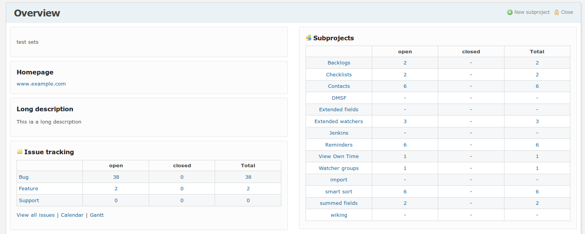

# Redmine Better Overview

Compatible with Redmine 4.1.x. The plugin version corresponds to minimum version of Redmine required.

Provides a better projects overview.

* Subprojects displayed as a table including stats about open/closed/total issues
* Project description styled in a box
* Project homepage styled in a box
* Project custom fields styled in a box

## Installation

Place the plugin code under the plugins directory and run 'bundle install', then restart Rails. 
Requires redmine_base_deface plugin.

    cd {redmine root}
    git clone https://github.com/maxrossello/redmine_better_overview.git plugins/redmine_better_overview
    bundle install
